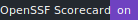
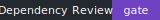

# Vexcalibur

[](https://github.com/vexcalibur-dev/vexcalibur/actions/workflows/ci.yml)
[](https://github.com/vexcalibur-dev/vexcalibur/actions/workflows/codeql.yml)
[](https://github.com/vexcalibur-dev/vexcalibur/actions/workflows/scorecard.yml)
[](https://github.com/vexcalibur-dev/vexcalibur/actions/workflows/dependency-review.yml)


Vexcalibur is an early VEX toolkit for vulnerability exploitability workflows across SBOM, package URL, and vulnerability data ecosystems.

The project is intended to replace legacy `vexy` usage while staying general-purpose instead of becoming Python-specific. The current scaffold includes an OSV-backed package URL query command, CycloneDX JSON and XML SBOM ingest, CycloneDX 1.6 VEX generation, a placeholder `vexy` compatibility command, and CI for Python package and documentation quality gates.

## Status

Pre-alpha. The public CLI and output formats are not stable yet.

Implemented now:

- Query OSV for one or more package URLs with `vexcalibur query-osv`.
- Generate CycloneDX 1.6 VEX JSON from CycloneDX JSON or XML SBOM input with `vexcalibur generate`.
- Generate VEX from local findings without contacting OSV.
- Use the same installed package through the legacy `vexy` executable name.
- Run offline tests, live OSV compatibility tests, linting, formatting checks, type checks, build checks, installed CLI checks, secret scanning, CodeQL, dependency review, and OpenSSF Scorecard.

Not implemented yet:

- Policy-driven VEX state selection for OSV-derived findings.
- Compatibility with existing `vexy` flags and output.
- A stable `vexcalibur-action` release.

## Development

Prerequisites:

- Python 3.10 or newer
- Poetry 2.x

Install dependencies:

```bash
poetry install
```

Run offline tests:

```bash
poetry run pytest -m "not live"
```

Run the live OSV compatibility smoke test only when you intentionally want to call the public OSV service:

```bash
poetry run pytest -m live -q
```

Run static checks:

```bash
poetry run ruff check .
poetry run mypy src
```

Build the documentation:

```bash
poetry install --extras docs
make docs
```

Try the CLI:

```bash
poetry run vexcalibur --help
```

Query OSV for a package URL:

```bash
poetry run vexcalibur query-osv pkg:pypi/django@1.2 --allow-public-osv
```

Expected result: the command prints the submitted package URL and any OSV vulnerability IDs returned by `https://api.osv.dev`.

Like `generate`, `query-osv` requires `--allow-public-osv` for the public OSV API and accepts `--osv-url` for private mirrors.

Generate CycloneDX VEX JSON from a CycloneDX SBOM:

`generate` refuses to send package URLs or component versions to the public OSV API unless you pass `--allow-public-osv`. Do not use that flag with private SBOMs or sensitive package inventories. Use `--osv-url` for a private OSV mirror. Library callers that inject an OSV client must also provide the matching `osv_base_url`; the same public-OSV opt-in check is enforced before the client is used.

```bash
poetry run vexcalibur generate tests/fixtures/sbom/cyclonedx-json-simple.json --allow-public-osv --output /tmp/vexcalibur-vex.json
```

Illustrative private-mirror command, replacing the URL with your internal OSV endpoint:

```bash
poetry run vexcalibur generate tests/fixtures/sbom/cyclonedx-json-simple.json --osv-url https://osv.internal.example --output /tmp/vexcalibur-vex.json
```

Offline command using local findings, replacing the file paths with your SBOM and findings JSON:

```bash
poetry run vexcalibur generate path/to/sbom.json --offline --findings-file path/to/findings.json --output /tmp/vexcalibur-vex.json
```

For a deterministic document timestamp, provide `--timestamp`. Live OSV data can change over time, so identical inputs can still produce different vulnerability findings unless OSV responses are controlled.

```bash
poetry run vexcalibur generate tests/fixtures/sbom/cyclonedx-json-simple.json --allow-public-osv --timestamp 2026-06-23T00:00:00Z --output /tmp/vexcalibur-vex.json
python - <<'PY'
import json
from pathlib import Path

vex = json.loads(Path("/tmp/vexcalibur-vex.json").read_text())
assert vex["bomFormat"] == "CycloneDX"
assert vex["specVersion"] == "1.6"
assert vex["metadata"]["timestamp"] == "2026-06-23T00:00:00+00:00"
print(f"validated {len(vex.get('vulnerabilities', []))} generated VEX findings")
PY
```

The OSV-backed generator queries OSV for versioned components with package URLs, emits CycloneDX vulnerability entries for OSV matches, and marks findings `in_triage` by default. Local findings can provide explicit VEX analysis states and details.

Supported input for all `generate` source modes:

- CycloneDX JSON SBOMs with `specVersion` `1.4`, `1.5`, or `1.6`; JSON input must be UTF-8.
- CycloneDX XML SBOMs rooted at `bom` in the `http://cyclonedx.org/schema/bom/1.4`, `/1.5`, or `/1.6` namespace; XML may use parser-detected XML encodings such as UTF-8 or UTF-16, and DTD, entity, and external-reference declarations are rejected.
- SBOM files up to 10 MiB, up to 10,000 components, and component nesting up to 50 levels.
- Unique `bom-ref` values for components with package URLs. Duplicate queried component refs are rejected because VEX `affects` entries refer to components by ref.
- Explicit source configuration. Public OSV requires `--allow-public-osv`; private mirrors use `--osv-url`; offline local findings use `--findings-file`.

Additional OSV-backed requirements:

- Components need package URLs and either a PURL version or a CycloneDX component `version`; unversioned components are not queried.
- The OSV query set must be non-empty. If no component can be queried precisely, the command fails instead of producing an empty VEX that looks authoritative.

Local findings mode can produce an empty VEX document when the findings file explicitly contains `"findings": []`.

## Project Links

- [Documentation](docs/index.md)
- [CI and recurring checks](docs/development/ci.md)
- [Security policy](SECURITY.md)
- [Contributing](CONTRIBUTING.md)
- [Python style policy](docs/development/python-style.md)
- [AI agent and style guidance](AGENTS.md)
- [License](LICENSE)
