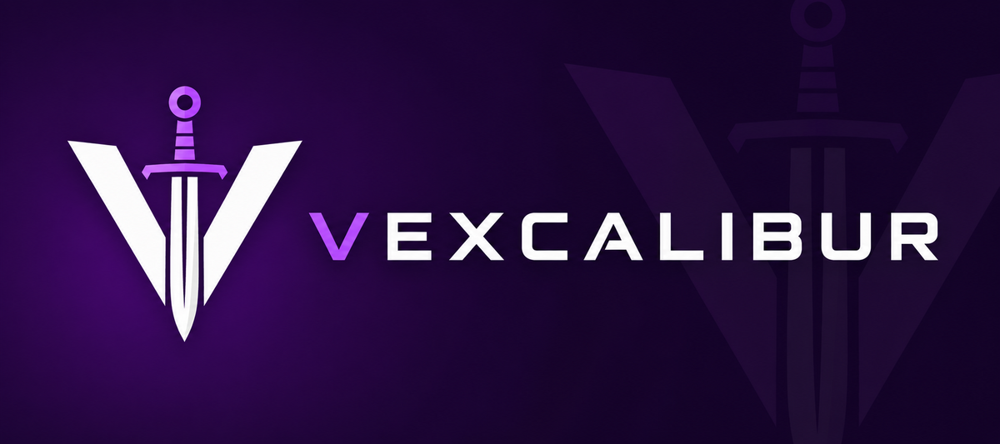

# Vexcalibur



[](https://github.com/vexcalibur-dev/vexcalibur/actions/workflows/ci.yml)
[](https://github.com/vexcalibur-dev/vexcalibur/actions/workflows/codeql.yml)
[](https://github.com/vexcalibur-dev/vexcalibur/actions/workflows/scorecard.yml)
[](https://github.com/vexcalibur-dev/vexcalibur/actions/workflows/dependency-review.yml)

Vexcalibur turns software bills of materials and vulnerability findings into VEX documents. It reads CycloneDX SBOMs or a GitHub Dependency Graph SBOM. Findings come from an OSV-compatible service or a local file.

Version 0.3.0 writes CycloneDX 1.6, OpenVEX 0.2.0, and CSAF 2.0 JSON. CSAF
output uses the `csaf_vex` profile.

The project is usable, but still pre-1.0. Pin an exact release because command flags, Python APIs, and detailed output may change.

## What works today

| Area | Support |
| --- | --- |
| SBOM input | CycloneDX JSON and XML 1.4–1.6; GitHub Dependency Graph SPDX 2.3 JSON |
| Finding sources | Public OSV with explicit consent; private OSV-compatible endpoints; local findings files |
| VEX output | CycloneDX 1.6 JSON; OpenVEX 0.2.0 JSON; CSAF 2.0 JSON with the `csaf_vex` profile |
| Automation | A companion [GitHub Action](https://github.com/vexcalibur-dev/vexcalibur-action) |
| Migration | A narrow `vexy` command-line compatibility layer |
| Python | 3.10–3.14 |

## Install a release

Create an environment and pin the package version:

```bash
python -m venv .venv
.venv/bin/python -m pip install "vexcalibur==0.3.0"
.venv/bin/vexcalibur --help
```

On Windows, use `.venv\Scripts\python` and `.venv\Scripts\vexcalibur`.

## Try local generation

Clone the repository, then install its locked dependencies:

```bash
uv sync
```

Dependency installation may contact the configured package index. The generation command below uses only local inputs and does not contact a vulnerability service.

Generate a VEX document from the committed example files:

```bash
uv run --frozen vexcalibur generate \
  tests/fixtures/sbom/cyclonedx-json-simple.json \
  --offline \
  --findings-file tests/fixtures/findings/all-analysis-states.json \
  --timestamp 2026-06-23T00:00:00Z \
  --output /tmp/vexcalibur-vex.json
```

Check the result:

```bash
python - <<'PY'
import json
from pathlib import Path

vex = json.loads(Path("/tmp/vexcalibur-vex.json").read_text())
assert vex["bomFormat"] == "CycloneDX"
assert vex["specVersion"] == "1.6"
assert len(vex["vulnerabilities"]) == 5
print("generated CycloneDX VEX")
PY
```

See the [quickstart](https://vexcalibur-dev.github.io/vexcalibur/tutorials/quickstart.html) for the guided version of this example.

CycloneDX remains the default output. Add `--format openvex` and identify the
document author to create OpenVEX. Add `--format csaf` and the required
document and publisher metadata to create a CSAF 2.0 VEX document. Follow the [OpenVEX
guide](https://vexcalibur-dev.github.io/vexcalibur/how-to/generate-openvex.html)
or [CSAF
guide](https://vexcalibur-dev.github.io/vexcalibur/how-to/generate-csaf.html)
for a runnable example and the format's evidence rules.

## Choose a finding source

Vexcalibur requires one finding source for each generation run.

| Inventory and trust boundary | Use |
| --- | --- |
| Findings already exist locally | Use `--findings-file findings.json`. Add `--offline` for a local SBOM. |
| Inventory may go to an internal service | `--osv-url https://osv.internal.example` |
| Inventory is approved for public OSV | `--allow-public-osv` |

> **Warning:** `--allow-public-osv` sends package URLs and versions to `https://api.osv.dev`. Do not use it with a private SBOM or sensitive package inventory unless that disclosure is approved.

The default public endpoint fails closed without that flag. Fetching an SBOM from GitHub is a separate network boundary and does not grant permission to send the resulting inventory to public OSV.

## Documentation

- Start with the [quickstart](https://vexcalibur-dev.github.io/vexcalibur/tutorials/quickstart.html).
- Follow the [CycloneDX](https://vexcalibur-dev.github.io/vexcalibur/how-to/generate-cyclonedx-vex.html), [OpenVEX](https://vexcalibur-dev.github.io/vexcalibur/how-to/generate-openvex.html), or [CSAF](https://vexcalibur-dev.github.io/vexcalibur/how-to/generate-csaf.html) generation guide.
- Use the [CLI reference](https://vexcalibur-dev.github.io/vexcalibur/reference/cli.html) for flags and failure behavior.
- Read the [CycloneDX](https://vexcalibur-dev.github.io/vexcalibur/reference/cyclonedx-vex-output.html), [OpenVEX](https://vexcalibur-dev.github.io/vexcalibur/reference/openvex-output.html), or [CSAF](https://vexcalibur-dev.github.io/vexcalibur/reference/csaf-output.html) output contract before consuming generated files.
- Read the [architecture](https://vexcalibur-dev.github.io/vexcalibur/explanation/architecture.html) before adding a source or output format.
- Check [project status](https://vexcalibur-dev.github.io/vexcalibur/explanation/project-status.html) for current limits.

The complete manual is at [vexcalibur-dev.github.io/vexcalibur][vexcalibur-docs].

## Contributing

Run the local quality gate:

```bash
make check
```

Documentation changes must also build without warnings:

```bash
uv sync --extra docs
make docs
```

See [CONTRIBUTING.md](CONTRIBUTING.md), the [security policy](SECURITY.md), and the [Python style policy](https://vexcalibur-dev.github.io/vexcalibur/development/python-style.html) before opening a pull request.

Use the [issue forms](https://github.com/vexcalibur-dev/vexcalibur/issues) for questions, bugs, and feature requests. The organization [support policy](https://github.com/vexcalibur-dev/.github/blob/main/SUPPORT.md) explains which public route to use, and the [code of conduct](https://github.com/vexcalibur-dev/.github/blob/main/CODE_OF_CONDUCT.md) applies to project spaces.

Vexcalibur is licensed under the [Apache License 2.0](LICENSE).

[vexcalibur-docs]: https://vexcalibur-dev.github.io/vexcalibur/
